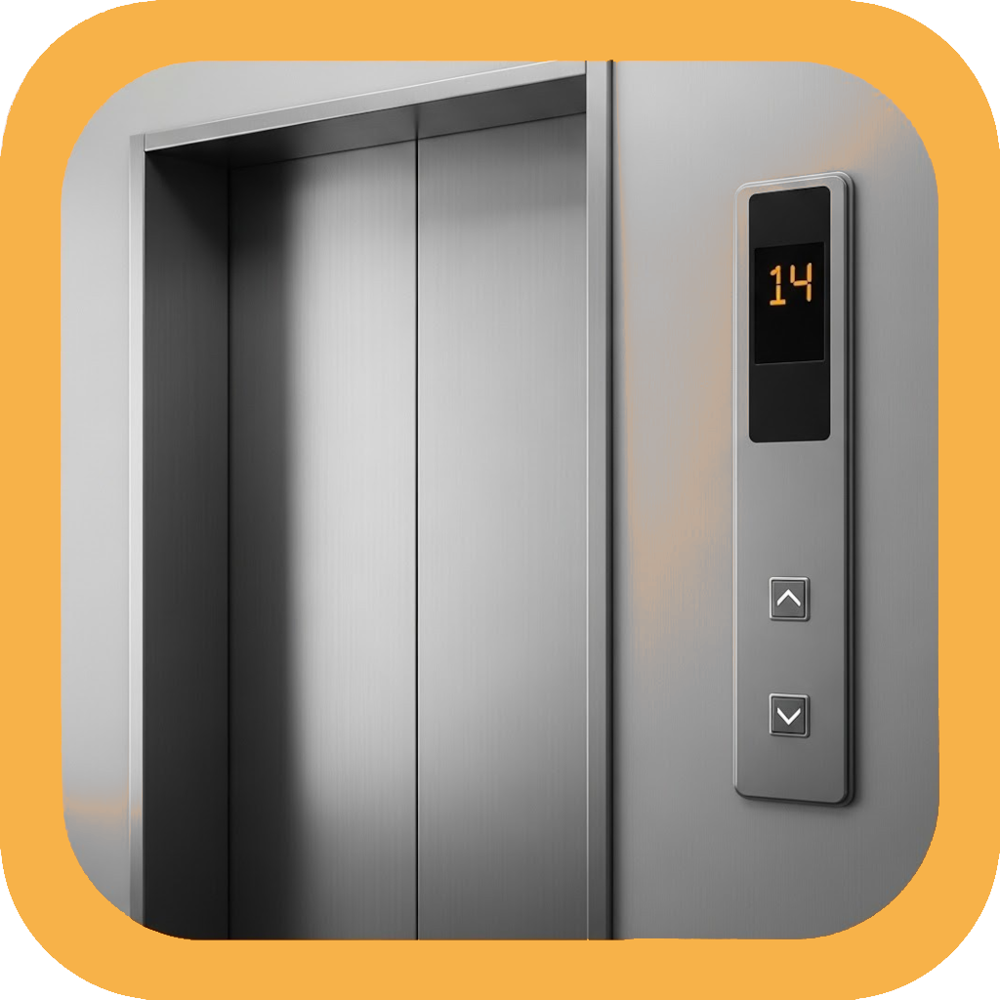

# LETS ELEVATOR NEO - Elevator Simulator

<div align="center">
  
  <br>
  <strong>Enjoy your favorite elevator anytime, anywhere</strong>
  <br>
  <strong>Hyper-real elevator sim powered by generative AI</strong>
</div>

## 📱 Application Overview

LETS ELEVATOR NEO is a Flutter-based simulation app for Android & iOS that lets you experience and operate elevators.
It provides a practical and enjoyable experience through Game Center and Google Play Games integration, ads, sound, and multi-language support.

### 🎯 Key Features

- **Realistic Elevator Operation**: Authentic elevator-like operation experience
- **Cross-platform Support**: Android & iOS compatibility
- **Game Center Integration**: Leaderboards & achievements
- **Multi-language Support**: Japanese, English, Korean, Chinese, Spanish
- **Google Mobile Ads**: Banner ads & rewarded ads
- **Firebase Integration**: Analytics, App Check
- **Audio & Vibration Feedback**: Realistic operation feel
- **Various Settings Screens**: Customizable options

## 🚀 Technology Stack

### Frameworks & Libraries
- **Flutter**: 3.3.0+
- **Dart**: 2.18.0+
- **Firebase**: Analytics, App Check
- **Google Mobile Ads**: Advertisement display

### Core Features
- **Audio**: audioplayers
- **Text-to-Speech**: flutter_tts
- **Vibration**: vibration
- **Localization**: flutter_localizations
- **Environment Variables**: flutter_dotenv
- **App Tracking Transparency**: app_tracking_transparency
- **File Management**: file_picker, image_picker, image_cropper
- **Permissions**: permission_handler
- **WebView**: webview_flutter
- **State Management**: hooks_riverpod, flutter_hooks

## 📋 Prerequisites

- Flutter 3.3.0+
- Dart 2.18.0+
- Android Studio / Xcode
- Firebase (App Check, Analytics, etc.)

## 🛠️ Setup

### 1. Clone the Repository
```bash
git clone https://github.com/fcb1899v/elevatorneo_flutter.git
cd elevatorsimulator_neo
```

### 2. Install Dependencies
```bash
flutter pub get
```

### 3. Environment Variables Setup
Create `assets/.env` file and configure required environment variables:
```env
IOS_BANNER_UNIT_ID="your-ios-banner-id"
ANDROID_BANNER_UNIT_ID="your-android-banner-id"
# Other ad IDs...
```

### 4. Firebase Configuration (Optional)
If using Firebase:
1. Create a Firebase project
2. Place `google-services.json` (Android) and `GoogleService-Info.plist` (iOS)
3. These files are automatically excluded by .gitignore

### 5. Run the Application
```bash
# Android
flutter run

# iOS
cd ios
pod install
cd ..
flutter run
```

## 🎮 Application Structure

```
lib/
├── main.dart              # Application entry point
├── homepage.dart          # Main page
├── menu.dart              # Menu page
├── settings.dart          # Settings page
├── games_manager.dart     # Game services management
├── sound_manager.dart     # Audio management
├── image_manager.dart     # Image management
├── admob_interstitial.dart # Interstitial advertisement management
├── admob_banner.dart      # Banner advertisement management
├── common_widget.dart     # Common widgets
├── constant.dart          # Constant definitions
├── extension.dart         # Extension functions
├── firebase_options.dart  # Firebase configuration
└── l10n/                  # Localization
    ├── app_en.arb
    ├── app_ja.arb
    ├── app_ko.arb
    ├── app_zh.arb
    └── app_es.arb

assets/
├── images/                # Image resources
│   ├── menu/             # Menu images
│   ├── button/           # Button images
│   ├── elevator/         # Elevator images
│   ├── room/             # Room background images
│   └── settings/         # Settings screen images
├── audios/               # Audio files
├── fonts/                # Font files
└── icon/                 # App icons
```

## 🎨 Customization

### Button Styles
- Shape: Round, Square, Star, Heart, Diamond, Clover, Cat, Phone, etc.
- Style: Multiple design patterns with pressed states
- Background: Various background themes

### Floor Settings
- Normal Mode: Standard floor numbers
- 1000-Floor Mode: 1000-story building
- Shimada Mode: Special configuration

### Visual Themes
- Door frames: Metal, Pop, White, Wood
- Elevator frames: Various materials and styles
- Room backgrounds: Multiple floor themes

## 📱 Supported Platforms

- **Android**: API 21+
- **iOS**: iOS 11.0+
- **Web**: Coming soon

## 🔧 Development

### Code Analysis
```bash
flutter analyze
```

### Run Tests
```bash
flutter test
```

### Build
```bash
# Android APK
flutter build apk

# Android App Bundle
flutter build appbundle

# iOS
flutter build ios
```

## 🔒 Security

This project includes security measures to protect sensitive information:
- Environment variables for API keys
- Firebase configuration files are excluded from version control
- Ad unit IDs are stored in environment files
- Keystore files are properly excluded

## 📄 License

This project is licensed under the MIT License.

## 🤝 Contributing

Pull requests and issue reports are welcome.

## 📞 Support

If you have any problems or questions, please create an issue on GitHub.

## 🚀 Getting Started

For new developers:
1. Follow the setup instructions above
2. Check the application structure
3. Review the customization options
4. Start with the main.dart file to understand the app flow

---

<div align="center">
  <strong>LETS ELEVATOR NEO</strong> - Experience the world of elevator!
</div>

## Licenses & Credits

This app uses the following open-source libraries:

- Flutter (BSD 3-Clause License)
- firebase_core, firebase_analytics, firebase_app_check (Apache License 2.0)
- google_mobile_ads (Apache License 2.0)
- shared_preferences (BSD 3-Clause License)
- flutter_dotenv (MIT License)
- flutter_tts (BSD 3-Clause License)
- audioplayers (MIT License)
- vibration (MIT License)
- games_services (MIT License)
- hooks_riverpod, flutter_hooks (MIT License)
- url_launcher (BSD 3-Clause License)
- webview_flutter (BSD 3-Clause License)
- cupertino_icons (MIT License)
- flutter_launcher_icons (MIT License)
- flutter_native_splash (MIT License)
- intl (BSD 3-Clause License)
- flutter_localizations (BSD 3-Clause License)
- file_picker (MIT License)
- image_picker (Apache License 2.0)
- image_cropper (Apache License 2.0)
- permission_handler (Apache License 2.0)
- connectivity_plus (Apache License 2.0)
- app_tracking_transparency (MIT License)
- path_provider (BSD 3-Clause License)

For details of each license, please refer to [pub.dev](https://pub.dev/) or the LICENSE file in each repository.
